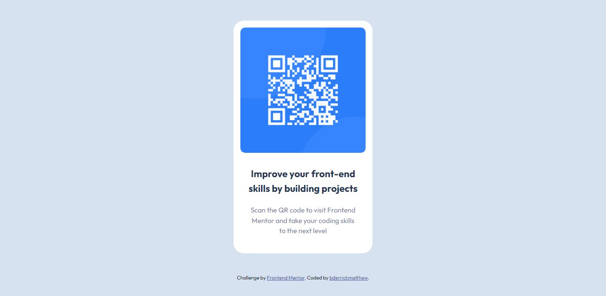

# Frontend Mentor - QR code component solution

This is a solution to the [QR code component challenge on Frontend Mentor](https://www.frontendmentor.io/challenges/qr-code-component-iux_sIO_H). Frontend Mentor challenges help you improve your coding skills by building realistic projects. 

## Table of contents

- [Overview](#overview)
  - [Screenshot](#screenshot)
  - [Links](#links)
- [My process](#my-process)
  - [Built with](#built-with)
  - [What I learned](#what-i-learned)
  - [Continued development](#continued-development)
  - [Useful resources](#useful-resources)
- [Author](#author)
- [Acknowledgments](#acknowledgments)


## Overview

### Screenshot




### Links

- Solution URL: [Github Repo](https://github.com/bderrickmatthew/qr-code-component/)
- Live Site URL: [Github Pages](https://bderrickmatthew.github.io/qr-code-component/)

## My process

### Built with

- Semantic HTML5 markup
- CSS custom properties
- CSS Grid
- Mobile-first workflow

### What I learned

I have learnt to use margins to center elements.
I have also learnt to follow the mobile-first workflow.

To see how you can add code snippets, see below:


```css
main {
    width: 80%;
    margin: 3em auto;
    padding: 1em 1em 2.5em 1em;
    background-color: var(--white);
    border-radius: 1.5em;
}
```

### Continued development

I will focus more on CSS Grid and Flexbox in the future.


## Author

- Frontend Mentor - [@bderrickmatthew](https://www.frontendmentor.io/profile/bderrickmatthew)
- Twitter - [@bderrickmatthew](https://www.twitter.com/bderrickmatthew)


## Acknowledgments

I would like to thank the folks over at stack overflow.
